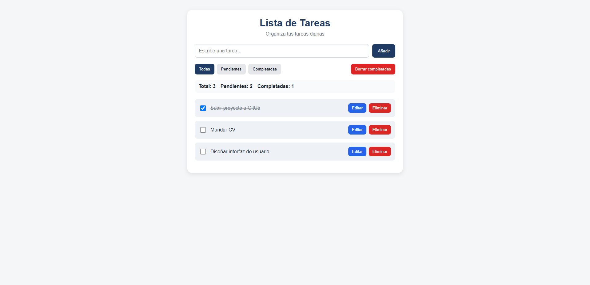

\# 📝 Lista de Tareas Web

Aplicación web para gestionar tareas diarias. Permite crear, editar, completar y eliminar tareas, con persistencia en el navegador.

\---

\## 🚀 Funcionalidades

\- ➕ Añadir tareas

\- ✏️ Editar tareas

\- ✅ Marcar como completadas

\- ❌ Eliminar tareas

\- 🧹 Borrar tareas completadas

\- 🔍 Filtros (todas, pendientes, completadas)

\- 📊 Contador de tareas

\- 💾 Guardado en localStorage

\---

\## 🛠️ Tecnologías

\- HTML5

\- CSS3

\- JavaScript (Vanilla)

\---

\## 💡 Descripción

Este proyecto simula una aplicación real de gestión de tareas, implementando funcionalidades típicas de un CRUD en el frontend.

Los datos se almacenan en el navegador mediante localStorage, permitiendo mantener la información incluso al recargar la página.

\---

## 📸 Captura

\## 📂 Estructura del proyecto

lista-tareas-web/

\- index.html  

\- styles.css  

\- script.js  

\- README.md  

\---

\## 🎯 Objetivo

Proyecto desarrollado como práctica para reforzar conceptos de desarrollo web:

\- Manipulación del DOM  

\- Gestión de eventos  

\- Persistencia de datos en cliente  

\- Organización del código  

\---

\## 👩‍💻 Autora

Carolina Crespo - Desarrolladora Junior 

